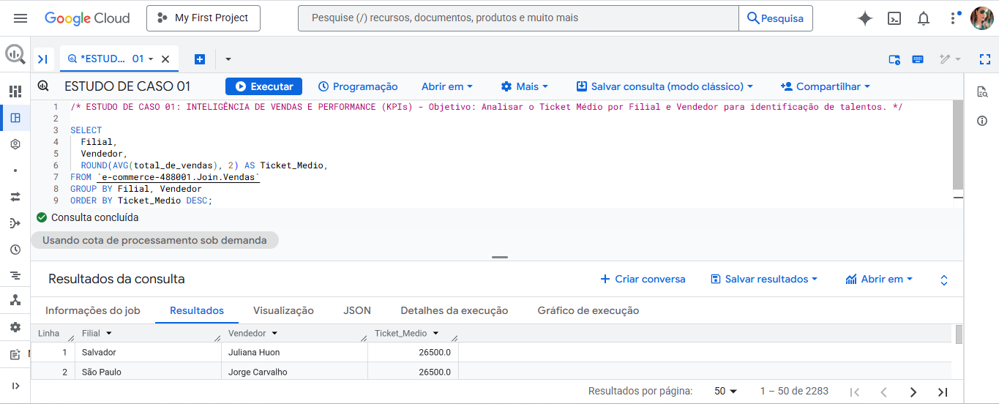
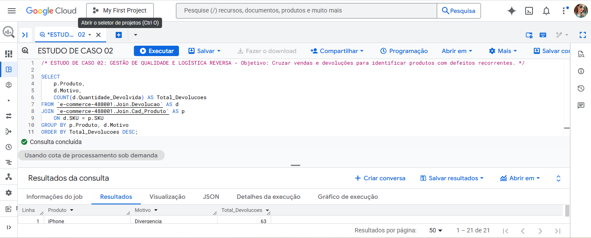
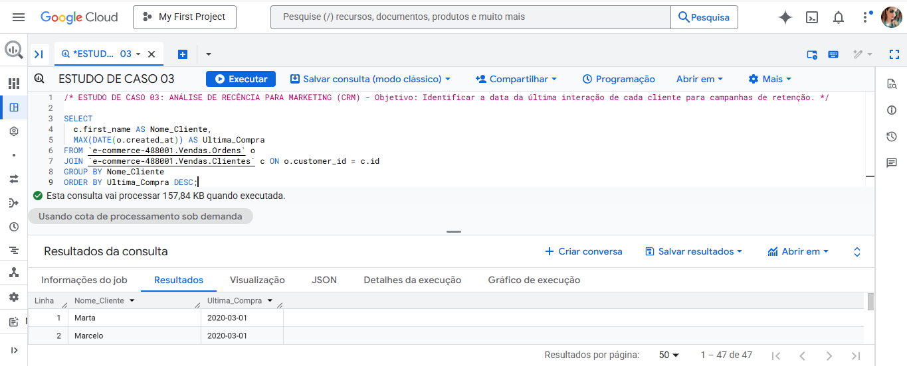

# 🚀 SQL Portfolio: Data Analytics em E-commerce com Google BigQuery

## 📌 Sobre o Projeto

Este repositório contém meu portfólio de projetos e consultas desenvolvidas durante o curso **"SQL Completo com Google BigQuery Para Análise de Dados"** (Udemy - Prof. Edmilson Alves). O foco principal foi a manipulação de dados de e-commerce em ambiente Cloud, transformando dados brutos em inteligência de negócios para tomada de decisão.

**Meu objetivo com este repositório é demonstrar:**

* **Capacidade técnica** em manipular grandes volumes de dados em nuvem;
* **Criação de lógica de negócios** complexa para resolução de problemas;
* **Estruturação de dados** com foco em suporte para ferramentas de visualização (BI), garantindo tabelas limpas e métricas pré-calculadas.

---

## 🛠️ Tecnologias e Ferramentas

---

## 🛠️ Habilidades Técnicas Demonstradas

### 1. Exploração e Qualidade de Dados
* **Exploração:** Uso de `SELECT`, `LIMIT` e `DISTINCT` para inspeção inicial de grandes volumes de dados.
* **Higienização:** Identificação de dados ausentes com `IS NULL` e `IS NOT NULL`, garantindo a integridade dos relatórios.
* **Padronização:** Uso de **Aliases** (`AS`) para renomeação de colunas e tabelas, tornando o código mais legível e profissional.

### 2. Filtros e Lógica Condicional
* **Segmentação:** Aplicação de filtros complexos com `WHERE`, `IN`, `NOT IN` e operadores de comparação.
* **Lógica de Negócio:** Criação de novas dimensões (como Regiões e Tiers de Clientes) através de funções `CASE WHEN` e operadores de intervalo (`BETWEEN`).

### 3. Modelagem Relacional e Agregações
* **Relacionamentos (Joins):** Conexão de múltiplas tabelas (Vendas, Produtos, Clientes, Devoluções) utilizando `INNER JOIN`.
* **Métricas de Performance:** Consolidação de indicadores através de `GROUP BY` e funções de agregação como `COUNT`, `SUM`, `AVG`, `MIN` e `MAX`.

### 4. Análise Temporal e Estatística
* **Manipulação de Datas:** Extração de tendências mensais e anuais utilizando `FORMAT_TIMESTAMP` e `DATE`.
* **Precisão Financeira:** Aplicação de arredondamentos com `ROUND` para cálculo de ticket médio.

---

### 🛠️ Matriz de Competências Técnicas

| Competência | Comandos e Funções Praticados |
| :--- | :--- |
| **Junção de Dados** | `JOIN`, `INNER JOIN`, `MULTI-JOIN` |
| **Agregações** | `COUNT`, `SUM`, `AVG`, `MIN`, `MAX`, `GROUP BY` |
| **Lógica e Filtros** | `WHERE`, `CASE WHEN`, `IN`, `NOT IN`, `BETWEEN` |
| **Manipulação de Datas** | `DATE`, `FORMAT_TIMESTAMP` |
| **Limpeza e Organização** | `IS NULL`, `IS NOT NULL`, `AS (ALIAS)`, `LIMIT` |

---

## 📂 Estrutura do Repositório

O projeto está organizado por módulos temáticos para facilitar a navegação:

* **`01-Fundamentos-e-Exploracao`**: Inspeção inicial de dados, mapeamento geográfico e padronização com Aliases.
* **`02-Filtros-e-Regras-de-Negocio`**: Segmentação de dados por nome, região e regras específicas de negócio.
* **`03-Auditoria-e-Qualidade-de-Dados`**: Técnicas para identificação e tratamento de dados ausentes ou inconsistentes.
* **`04-Filtros-Avancados`**: Aplicação de operadores comparativos e filtros de intervalo (Between).
* **`05-Logica-Condicional-e-Categorizacao`**: Reclassificação de categorias e segmentação de perfil de cliente com Case When.
* **`06-Modelagem-e-Uniao-de-Dados`**: Integração entre diferentes tabelas de vendas e produtos para visão 360º.
* **`07-Agregacoes-e-Ordenacao`**: Resumos executivos de vendas, contagens condicionais e análise de causa raiz.
* **`08-Analise-de-Performance`**: Cálculo de KPIs financeiros, ticket médio e análise de ciclo de vida (Recência).

---

## 📊 Estudos de Caso: Resolvendo Problemas de Negócio

Para demonstrar a aplicação prática dos conhecimentos adquiridos, utilizei as consultas deste repositório para responder a desafios reais e perguntas críticas de negócio:

### 1. Inteligência de Vendas e Performance (KPIs)
* **Problema:** A diretoria precisava identificar quais vendedores e filiais estavam performando acima da média e quais precisavam de treinamento.
* **Solução:** Desenvolvi consultas utilizando `AVG`, `ROUND` e `GROUP BY` para calcular o Ticket Médio por filial e vendedor.
* **Impacto:** Identificação rápida de discrepâncias regionais e reconhecimento dos melhores talentos da equipe comercial.

### 2. Gestão de Qualidade e Logística Reversa
* **Problema:** O índice de devoluções estava alto e o motivo era desconhecido.
* **Solução:** Cruzei as tabelas de vendas e produtos via `JOIN`, agrupando por motivo de devolução.
* **Impacto:** Descobri quais produtos específicos apresentavam defeitos recorrentes, fornecendo insumos para a revisão de estoque e negociações logísticas.

### 3. Estratégia de Marketing e Retenção (CRM)
* **Problema:** O time de marketing precisava reativar clientes antigos e premiar os novos.
* **Solução:** Utilizei funções de agregação temporal (`MIN` e `MAX` combinados com `DATE`) para mapear a Primeira e a Última Compra de cada cliente.
* **Impacto:** Segmentação precisa da base para campanhas de recuperação de clientes.

### 📂 Evidências e Resultados Técnicos

A tabela abaixo centraliza todo o fluxo da análise: desde a construção da lógica no **SQL**, passando pela **evidência de execução** no BigQuery, até a entrega do **dado final** para o negócio.

| Estudo de Caso | 💻 Script SQL (Lógica) | 📸 Execução (BigQuery) | 📄 Resultado da Consulta |
| :--- | :--- | :---: | :---: |
| **01. Inteligência de Vendas** | [Ver Código SQL](./08-Analise-de-Performance/03-ticket-medio-e-arredondamentos.sql) |  | [👁️ Visualizar Dados](./09-Estudos-de-Caso/1-inteligencia-vendas-performance.csv) |
| **02. Gestão de Qualidade** | [Ver Código SQL](./07-Agregacoes-e-Ordenacao/04-analise-causa-raiz-devolucao.sql) |  | [👁️ Visualizar Dados](./09-Estudos-de-Caso/2-gestao-qualidade-logistica-reversa.csv) |
| **03. Estratégia de Marketing** | [Ver Código SQL](./08-Analise-de-Performance/02-ciclo-de-vida-cliente-recencia.sql) |  | [👁️ Visualizar Dados](./09-Estudos-de-Caso/3-estrategia-marketing-retencao.csv) |

---

## ✉️ Contato

* **Nome:** Lidiane  

---